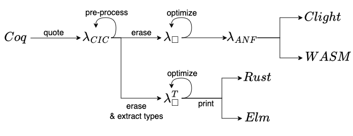

# Dev environment setup
```bash
git clone https://github.com/AU-COBRA/lambda-box-extraction.git
cd lambda-box-extraction
opam switch create . 4.14.2 --repositories default,coq-released=https://coq.inria.fr/opam/released
eval $(opam env)
opam install . --deps-only
```

The project can be built with `make`.
Running the dev executable with `dune exec lbox`.


# Coq Extractions
## Pipeline


## Translations
* Coq -> $\lambda_{CIC}$
  * Quote function (Coq -> Coq AST) implemented in OCaml: https://github.com/MetaCoq/metacoq/blob/coq-8.20/template-coq/src/run_template_monad.ml#L442
  * Translation from Coq AST -> $\lambda_{CIC}$: https://github.com/MetaCoq/metacoq/blob/coq-8.20/template-pcuic/theories/TemplateToPCUIC.v
  * Coq AST definition: https://github.com/MetaCoq/metacoq/blob/coq-8.20/template-coq/theories/Ast.v
  * $\lambda_{CIC}$ definition: https://github.com/MetaCoq/metacoq/blob/coq-8.20/pcuic/theories/PCUICAst.v
* $\lambda_{CIC}$ -> $\lambda_{\square}$
  * Translation: https://github.com/MetaCoq/metacoq/blob/coq-8.20/erasure-plugin/theories/ETransform.v
  * $\lambda_{\square}$ definition: https://github.com/MetaCoq/metacoq/blob/coq-8.20/erasure/theories/EAst.v
* $\lambda_{CIC}$ -> $\lambda_{\square}^T$
  * Translation: https://github.com/MetaCoq/metacoq/blob/coq-8.20/erasure/theories/Typed/Erasure.v#L1505
  * $\lambda_{\square}^T$ definition: https://github.com/MetaCoq/metacoq/blob/coq-8.20/erasure/theories/Typed/ExAst.v
* $\lambda_{\square}$ -> $\lambda_{ANF}$
  * https://github.com/CertiCoq/certicoq/wiki/The-CertiCoq-pipeline
  * AST: https://github.com/CertiCoq/certicoq/blob/master/theories/LambdaANF/cps.v
* $\lambda_{\square}^T$ -> Rust
  * Printing: https://github.com/AU-COBRA/coq-rust-extraction/blob/master/theories/RustExtract.v
* $\lambda_{\square}^T$ -> Elm
  * Printing: https://github.com/AU-COBRA/coq-elm-extraction/blob/master/theories/ElmExtract.v
* $\lambda_{ANF}$ -> Clight
* $\lambda_{ANF}$ -> WASM
  * https://github.com/womeier/certicoqwasm/blob/master/theories/CodegenWasm/LambdaANF_to_Wasm.v

## Examples
* Rust
  * https://github.com/AU-COBRA/coq-rust-extraction/tree/master/tests/theories
* Elm
  * https://github.com/AU-COBRA/coq-elm-extraction/tree/master/tests/theories
* WASM
  * https://github.com/womeier/certicoqwasm-testing
* C (Clight)
  * https://github.com/CertiCoq/certicoq/blob/master/benchmarks/tests.v
